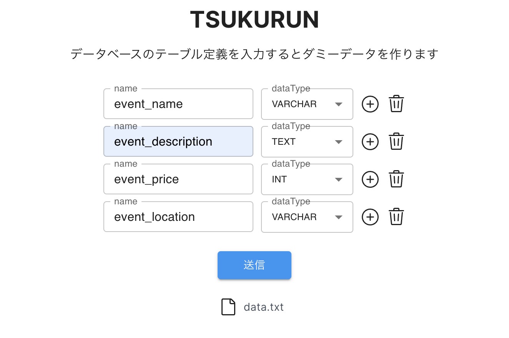

This is a db record generator in a csv format.
In this app, a user inputs table definition, and then request to Gemini API to generate dummy data for the table.



## Usage

- clone this repo and create `.env.local` in your project root.
- set your gemini api key in `.env.local`

```
API_KEY=xxxx
```

- run the development server:

```bash
npm run dev
```

Open [http://localhost:3000](http://localhost:3000) with your browser to see the result.
